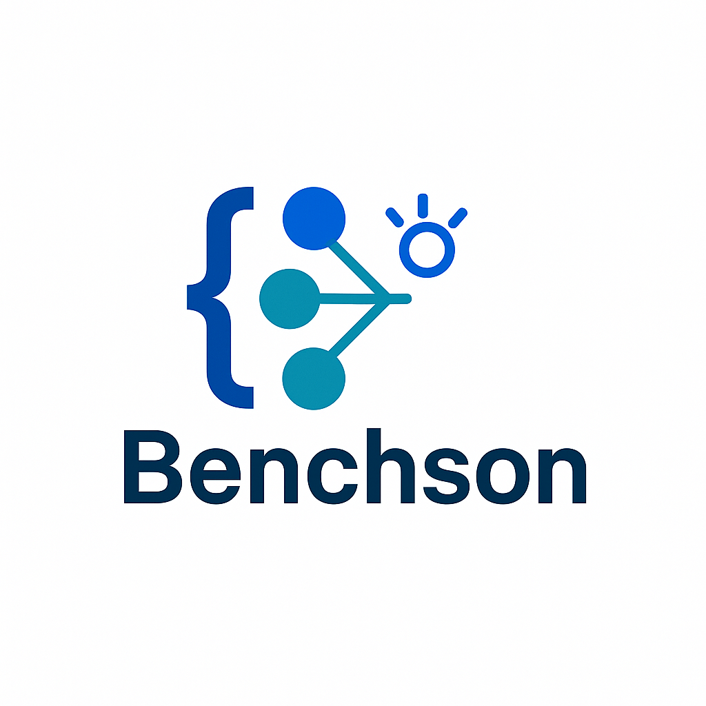

<p align="center">
  
</p>

# Benchson

**Benchson** is a toolkit for **automatically generating** and **modifying** JSON Schemas and JSON instances using a large language model (IBM Watsonx LLM). It supports both **strict** and **dynamic** schema generation, instance creation, schema-valid modifications, and comprehensive diff reporting.  
**The core goal of this project is to generate a dataset of tasks designed for large language models (LLMs), focusing on the creation and modification of JSON data.** The dataset includes diverse prompts and structured examples to train or evaluate LLMs in understanding, generating, and editing JSON documents based on natural language instructions.


## Table of Contents

1. [Overview](#overview)
2. [Features](#features)
3. [Project Index](#project-index)
4. [Getting Started](#getting-started)

   * [Prerequisites](#prerequisites)
   * [Installation](#installation)
5. [Usage](#usage)
6. [Contributing](#contributing)
7. [License](#license)
8. [Acknowledgments](#acknowledgments)

---

## Overview

Benchson streamlines JSON data management by offering an end-to-end solution for:

* Generating **valid JSON Schemas** (strict & dynamic).
* Producing **JSON instances** conforming to those schemas.
* Applying **schema-valid modifications** to JSON data.
* diffing and **reporting** changes automatically.

Ideal for projects focused on training or evaluating LLMs in structured data tasks, including robust JSON generation, validation, and controlled schema-driven modifications.


---

## Features

| Category                | Details                                                                                                                                                                                                                  |
| ----------------------- | ------------------------------------------------------------------------------------------------------------------------------------------------------------------------------------------------------------------------ |
| 📐 Schema Generation    | Create draft-07 compliant **strict** schemas (with `additionalProperties: false`) or **dynamic** schemas (nested objects, arrays, `if`/`then`/`else`, `patternProperties`), **excluding** support for `$ref` references. |
| 📄 Instance Generation  | Generate JSON instances that **exactly** match any given schema.                                                                                                                                                         |
| 🔄 Valid Modifications  | Apply transformations (add/remove fields, rename keys, type conversions, conditional updates) while preserving validity.                                                                                                 |
| 🔍 Validation & Quality | Use `jsonschema` to validate schemas and instances.                                                                                                                                                                      |
| 🔬 Diff & Reporting     | Leverage `DeepDiff` to detect and classify changes, and produce human-readable reports.                                                                                                                                  |
| ⚙️ Extensible Prompts   | Define or tune prompts in YAML for both schema and instance generation.                                                                                                                                                  |
| 🔌 LLM Integration      | Plug-and-play with IBM Watsonx LLM (extendable to other LLM backends).                                                                                                                                                   |

## Project Index

```
Benchson/
├── config
├── lists
│   ├── themes.txt
│   ├── structures.txt
│   ├── modifications_for_strict_schema.txt
│   └── modifications_for_dynamic_schema.txt
├── src
│   ├── main.py
│   ├── generate_data.py
│   ├── LLM_json_generator.py
│   ├── validation.py
│   ├── json_comparator.py
│   └── prompts.yaml
├── .env.sample
├── requirements.txt
└── .gitignore
```

---

## Getting Started

Follow these steps to get Benchson up and running locally.

### Prerequisites

* Python 3.12
* `pip` package manager
* IBM Watsonx LLM credentials (or another supported LLM endpoint)

### Installation

1. **Clone the repository**

   ```bash
   git clone https://github.com/IttaySegal/benchson.git
   cd benchson
   ```

2. **Create & activate a virtual environment**
   <details>
   <summary> Linux / macOS (bash, zsh)</summary>
   
   ```bash
   python3 -m venv .venv
   source .venv/bin/activate
   ```
   </details>

   <details>
   <summary> Windows PowerShell</summary>
   
   ```bash
     python -m venv .venv
     .\.venv\Scripts\Activate.ps1
   ```
   </details>

   <details>
   <summary> Windows CMD</summary>
   
   ```bash
     python -m venv .venv
     .\.venv\Scripts\activate.bat
   ```
   </details>

   <details>
   <summary>Activate the virtual‑env without typing commands</summary>

   ### VS Code

   1. Open the project folder in VS Code.  
   2. Press <kbd>Ctrl + Shift + P</kbd> (⇧⌘P on macOS) and run **Python: Select Interpreter**.  
   3. Choose the interpreter that lives inside **.venv**.  
      >    VS Code now launches every integrated terminal with the venv active and runs the correct Python for debugging and tasks.
   ### PyCharm / IntelliJ IDEA

   1. Go to **File → Settings → Project → Python Interpreter**.  
   2. Click the ⚙️ gear → **Add Interpreter → Existing VirtualEnv**, then browse to `./.venv`.  
   3. Click **OK**. 
   >    All run‑configurations and the built‑in terminal will use that environment automatically.  
   
   </details>


3. **Install dependencies**

   ```bash
   pip install -r requirements.txt
   ```

---

### Configuration

The **`config/model.py`** file contains your LLM setup and generation parameters:

```python
# config/model.py
model_name = "mistralai/mistral-large"
model_parameters = {
    "max_new_tokens": 500,
    "decoding_method": "greedy",
    "temperature": 0.9,
    "repetition_penalty": 1.0,
    "top_k": 50,
    "top_p": 1.0,
    "random_seed": 42,
    "stop_sequences": []
}
```

* **`model_name`**: The LLM model identifier (e.g., an IBM Watsonx or other supported model).
* **`model_parameters`**: Controls generation settings like token limits, sampling strategy, and randomness.

Customize these values to switch models or fine-tune output quality for your use case.

**LangChain Integration**

Benchson leverages **LangChain** to manage prompt templates and orchestrate LLM calls:

* **PromptTemplate & Chain**: Prompts are defined in `src/prompts.yaml` and loaded via LangChain's `PromptTemplate` for schema and instance tasks.
* **LLM Integration**: The `LLM_json_generator.py` uses LangChain abstractions (`LLMChain`, `StrOutputParser`) to build and execute multi-step prompt chains against the configured LLM.

---

## Usage

Run the Benchson pipeline to generate schemas, instances, apply modifications, validate, and produce diff reports:

```bash
python src/main.py
```

**Output Organization**

Benchson writes outputs under the `data/` directory with separate folders for each schema type:

```
data/
├── data_strict_schema/
│   ├── data/
│   ├── errors/
│   ├── no_changes/
│   ├── schemas/
│   └── diffs/
└── data_dynamic_schema/
    ├── data/
    ├── errors/
    ├── no_changes/
    ├── schemas/
    └── diffs/
```

Within each schema-type folder:

* `data/` — successful modifications with real changes
* `errors/` — validation failures
* `no_changes/` — operations that resulted in no diff
* `schemas/` — generated schema files
* `diffs/` — human-readable change reports

---

## Contributing

💬 Join the Discussions: Share your insights, provide feedback, or ask questions.
🐛 Report Issues: Submit bugs found or log feature requests for the project.
💡 Submit Pull Requests: Review open PRs, and submit your own PRs.

**Contributing Guidelines**

1. **Fork the Repository**: Start by forking the project repository to your GitHub account.
2. **Clone Locally**: Clone the forked repository to your local machine using a git client.

   ```bash
   git clone https://github.com/your-org/benchson.git
   ```
3. **Create a New Branch**: Always work on a new branch, giving it a descriptive name.

   ```bash
   git checkout -b new-feature-x
   ```
4. **Make Your Changes**: Develop and test your changes locally.
5. **Commit Your Changes**: Commit with a clear message describing your updates.

   ```bash
   git commit -m 'Implemented new feature x.'
   ```
6. **Push to GitHub**: Push the changes to your forked repository.

   ```bash
   git push origin new-feature-x
   ```
7. **Submit a Pull Request**: Create a PR against the original project repository. Clearly describe the changes and their motivations.
8. **Review**: Once your PR is reviewed and approved, it will be merged into the main branch. Congratulations on your contribution!

---

## Authors

This project was developed as part of an IBM Starship internship at the **Cloud Center of Excellence (CCOE)** lab in **Beer Sheva**.

- **Meshi Levi** – [@MeshiLevi](https://github.com/MeshiLevi)
- **Itay Segal** – [@IttaySegal](https://github.com/IttaySegal)
---

## License

This project is licensed under the **MIT License**. See the [LICENSE](LICENSE) file for details.

---

## Acknowledgments

* [IBM Watsonx](https://cloud.ibm.com) for the LLM services.
* [jsonschema](https://pypi.org/project/jsonschema/) for schema validation.
* [DeepDiff](https://github.com/seperman/deepdiff) for JSON comparison.
* Community contributors and early adopters for feedback and testing.
